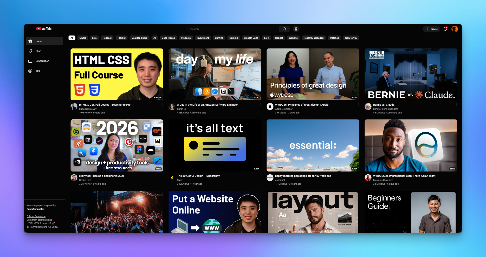
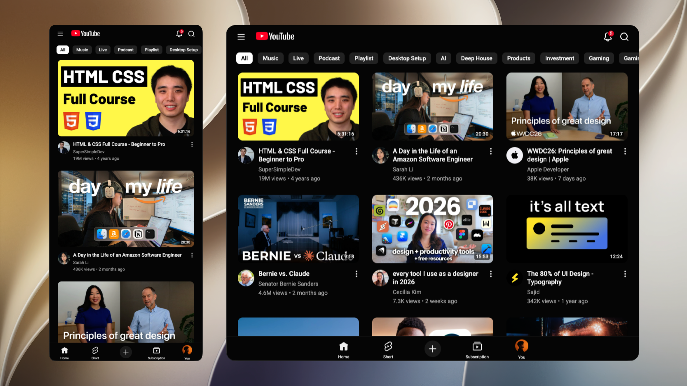

# YouTube UI Clone 🎥

This is my very first front-end development web project! In this project, I challenged myself to build a high-fidelity replica of the YouTube interface from scratch. I focused deeply on learning how to make a website fully responsive, managing complex layouts, and solving tricky JavaScript interaction bugs without using any external frameworks.

## 🌟 Live Preview

You can test and interact with the live website here:  
👉 **[Check Out the Live Demo](https://YOUR_GITHUB_USERNAME.github.io/YOUR_REPOSITORY_NAME)**

### 🎥 Interactive Quick Demo


---

## 🛠️ Built With

- **HTML5:** To create the basic structure and layout blueprint of the website (`index.html`).
- **CSS3:** To style the pages and build custom components using Flexbox, CSS Grid, and Media Queries.
- **Vanilla JavaScript:** To dynamically generate the video cards via arrays and handle complex click interactions (`js/main.js`).

---

## 🚀 Technical Challenges & What I Learned

### 1. Mastering Event Propagation (`event.stopPropagation()`) — _Most Challenging!_

The most exciting problem I solved in this project was managing nested click events inside the video cards.

- **The Problem:** The entire video preview card has an `onclick` event to redirect users to the video link. However, inside that card, there are smaller buttons like the channel profile avatar, subscriber buttons, and the "More Options" menu button. Initially, clicking these inner buttons would accidentally trigger the main video link as well (a behavior known as _Event Bubbling_).
- **The Solution:** In `js/main.js`, I successfully implemented `event.stopPropagation()` on all inner elements (channel links, subscribe buttons, and info menus). This isolates the clicks, ensuring that interacting with a channel profile popup or a menu does not accidentally open the video. This is a crucial skill for building professional, interactive web apps!

### 2. High-Fidelity Channel Profile Hover Card (CSS Transitions & Bridge Hack)

Building the interactive popup card (`.card-profile`) that appears when hovering over a creator's name or avatar was a major structural milestone.

- **The Challenge:** The profile card needs to float perfectly above other video cards using `position: absolute`. However, because there is a physical gap between the channel link text and the floating card, moving the mouse towards the card would immediately lose the hover state, causing the card to disappear instantly.
- **The Solution:** I utilized CSS visibility and opacity transitions (`transition: opacity 0.3s ease, visibility 0.3s ease`) combined with a clever CSS invisible pseudo-element bridge (`.card-profile::before`). This invisible layer fills the gap between the trigger text and the card, keeping the hover state active as the cursor smoothly glides into the popup.

### 3. Full Responsive Layout (Mobile, iPad, and Desktop)

I wrote custom Media Queries to make sure the website looks beautiful and adapted on all screen sizes:

- **Mobile Screens (< 576px):** The video grid changes to 1 column. The sidebar shifts to the bottom of the screen as a mobile navigation bar for ergonomic thumb accessibility.
- **Tablet / iPad Screens (768px - 1024px):** The top search bar hides unneeded buttons to fit smaller viewports, and the grid scales dynamically into 2 or 3 columns.
- **Desktop Screens (>= 1025px):** The layout expands into a multi-column view (up to 4 columns), revealing the full sidebar and a blur-effect category carousel at the top.

### 4. Layer Management with `z-index`

Preventing overlapping elements from clipping into each other was another layout puzzle. I resolved this by meticulously organizing the stacking layers:

- `z-index: 100` keeps the Top Header pinned at the very top.
- `z-index: 99` handles the Sidebar controllers.
- `z-index: 2` ensures the Floating Channel Profile Hover Card floats safely above the video thumbnails when you hover over a creator's name.

### 5. Lightweight Custom Tooltip System

Instead of importing heavy JavaScript libraries, I built tooltips purely using CSS. By mapping a `data-tooltip` attribute to the HTML buttons and styling them with CSS pseudo-elements (`::after`), description bubbles smoothly appear on hover with minimal performance cost.

---

## 📸 Project Screenshots

### 🖥️ Desktop View



### 📱 Tablet & Mobile View



---

## 📂 File Directory Structure

```text
├── assets/
│   ├── icons/          # SVG icons for buttons (hamburger, search, etc.)
│   └── images/         # Profile pictures, screenshots, and video thumbnails
├── js/
│   └── main.js         # JavaScript array mapping and event stopPropagation logic
├── styles/
│   ├── general.css     # CSS Reset, font styles, and tooltip logic
│   ├── header.css      # Top navigation and search bar layouts
│   ├── sidebar.css     # Side menu and bottom mobile nav adapters
│   └── video.css       # Video grids, thumbnails, and profile hover cards
└── index.html          # Main HTML structure
```

---

## 💡 Acknowledgments

This practice project was inspired by the web development tutorials from [**SuperSimpleDev**](https://github.com/SuperSimpleDev). It served as an amazing sandbox to push my foundational understanding of pure CSS architectures and modern DOM manipulation.

---

_Created with passion by **Rahmad Bintang Aji** — 2026_
